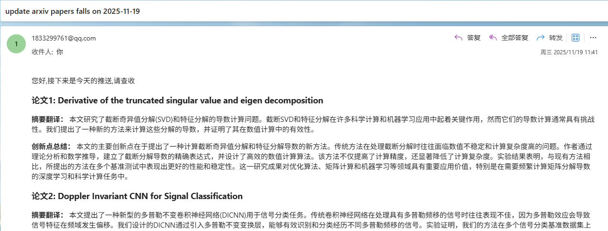

# arxivgetter
用于每天获取arxiv上最新的论文并自动推送至您的邮箱中,有关于文章类型数量等均可自定义,同时支持个性化总结
前提准备:建议在Linux系统下的服务器中部署该项目,故后面的教程均以Linux系统为例
效果如下展示

## 克隆项目
```bash
git clone https://github.com/xmdjy/arxivgetter.git
cd arxivgetter
```
## 配置环境
首先创建一个用于arxivgetter的虚拟环境
```bash
python3 -m venv arxivgetter
```
安装完成后激活环境
```bash
source arxivgetter/bin/activate
```
接下来安装依赖
```bash
pip install -r requirements.txt
```
## 配置文件
使用前请手动创建一个config.yaml的配置文件,用于自定义邮箱、LLM调用以及论文筛选等信息,具体格式如下:
```yaml
email:
  sender: ""
  server: ""
  port: 
  password: ""
  to_addr: ""

llm:
  api_keys: ''

papaers:
  max_results: 
  query_content: ""
```
自动邮件推送部分请参考有关smpt服务的相关内容自己配置,有关于论文筛选的参数`max_results`表示每日抓取文章上限,`query_content`表示文章类型,如与人工智能相关的类型名为cs.AI,其他类名请参考[arxiv分类列表](https://arxiv.org/category_taxonomy)
更改prompt以实现自定义请修改utils/ai_summarize中的message中的content
## 运行
配置完成后即可运行脚本
```bash
python main.py
```
## 设置定时任务
这里建议使用linux中的systemd服务实现
首先需要确定以下三个参数:
- user:whoami获取
- workingdirectory:pwd获取
- execstart:python的绝对路径,可通过which python获取
下面给服务器开24h的运行
```bash
sudo nano /etc/systemd/system/arxivgetter.service
```
创建了一个新service文件,其中服务名称为arxivgetter,内容如下:
```ini
# /etc/systemd/system/arxivgetter.service
[Unit]
Description=ArXiv Daily Paper Getter Service
After=network.target
[Service]
User=
Group=
WorkingDirectory=
Restart=on-failure
RestartSec=5
StandardOutput=journal
StandardError=journal
Environment="PYTHONUNBUFFERED=1"
[Install]
WantedBy=multi-user.target
```
重新加载systemd配置文件
```bash
sudo systemctl daemon-reload
```
启动服务    
```bash
sudo systemctl start arxivgetter.service
```
检查服务状态
```bash
sudo systemctl status arxivgetter.service
```
设置开机自启
```bash
sudo systemctl enable arxivgetter.service
```
重启服务
```bash
sudo systemctl restart arxivgetter.service
```